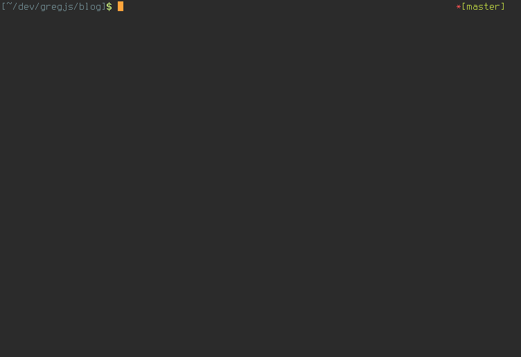
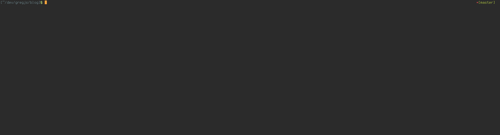
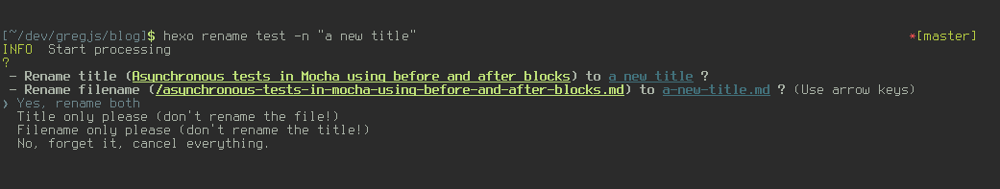
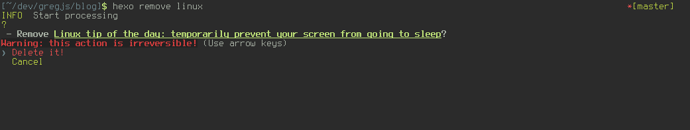

# hexo-cli-extras

This is a simple plugin for [Hexo](https://github.com/hexojs/hexo), a Node.js-based static site generator/blog framework.

It adds a handful of useful (to me) commands to the Hexo command-line interface: `edit`, `rename`, `remove`, `isolate` and `integrate`. Check out some gifs to see how it works or read a detailed explanation below or on the command line with `hexo help` followed by one of the commands.

Basic terminal editing:



Basic GUI editing and selection on tag (sorry for the bad resolution):



## edit

Opens posts, pages or drafts in your favorite $EDITOR or associated text editor.

```
hexo edit [title] [-a | --after MM-DD-YYYY] [-b | --before MM-DD-YYYY] [-c | --category | --categories CATEGORY] [-f | --folder SUBFOLDER] [-l | --layout] [-t | --tag | --tags TAG] [--draft | --drafts] [-g | --gui] [-p | --page | --pages]
```

### quick examples

```
hexo edit
```
--> will give you a menu of *all* your posts in descending chronological order, select one to edit

```
hexo edit search term
```
--> will filter the database for regular expressions "search" and "term"

```
hexo edit -a 11-11-2015 -g
```
--> will look in database for all articles published after 11/11/2015 and open the selected article in gui mode

```
hexo edit neovim -c vim
```
--> will look in database for articles in the "vim" category and matching the regular expression "neovim" in its title or slug

### detailed information (get this info on the command line with `hexo help edit`)

- `title` is a regular expression (case insensitive and spaces are allowed) for matching the title of a post
- `-a` or `--after` (optional) lets you filter out all posts that were made before the given date. A little parsing is done to help you, but use `MM-DD-YYYY` for best results
- `-b` or `--before` (optional) lets you filter out all posts that were made after the given date. A little parsing is done to help you, but use `MM-DD-YYYY` for best results
- `-c` or `--category` (optional) allows you to filter your posts on category
- `-f` or `--folder` (optional) is (part of) the name of a subfolder in `hexo_dir/source` to narrow down your search if you have multiple post folders (for filtering on drafts, prefer to use `-d`)
- `-l` or `--layout` (optional) filters on posts/pages with a specific layout
- `-t` or `--tag` (optional) allows you to filter your posts on tag
- `--draft` or `--drafts` (optional) lets you exclude all published posts
- `-g` or `--gui` (optional) is an option to open files using an associated GUI editor, rather than your terminal editor set in $EDITOR
- `-p` or `--page` (optional) selects pages instead of posts


*Note: boolean options can be combined (for example `hexo edit -dp` to search for drafts that are pages)*

*Note: Drafts will only appear in searches without the `--drafts` option if you have `render_drafts` set to true in `_config.yml`. If set to false, you'll have to use the `--draft` option to filter on drafts. Also, drafts will be excluded automatically if you use any of the date filters, as a date makes little sense for a draft.*

*Note: Filter on title first and use boolean options last or you may get unexpected results. For example, `hexo edit -g my post` will filter just on "post" whereas `hexo edit my draft -g` will correctly filter on "my draft".*

*Note: By default, files will open in your current terminal window, using whatever you've set as the global `$EDITOR` variable (you can set it in `.bashrc` or `.zshrc` if it's empty, don't forget to source the file before testing). The `gui` option (or the lack of an `$EDITOR` variable) will cause files to open with `xdg-open` (linux, osx) or `start` (windows)*

## rename

Rename a post, page or draft. The title and the filename can be renamed independently or both at the same time.



```
hexo rename <old title/slug> <-n | --new "new title">
```

`old title/slug` is one or more regular expression to find a post or page. If more match your regex, a selection menu will be displayed.

`new title` is the new title for your post. In case you just want to rename the file, it will be `slugize`d automatically (ie it will get converted to lower case, and all special characters and spaces will be made url-friendly).

After selecting a file, you will be presented with another menu. From there you can choose whether to rename the filename, the title of the post, both, or cancel altogether.

*Note: if you have set `render_drafts` to false in `_config.yml`, you won't be able to rename drafts from the command line. It works only with that setting set to true or if you publish the post first.*

*Note: wrap the new title in single or double quotes! If you forget, the presence of spaces or special characters may cause strange behavior.*


## remove

Delete a post.



```
hexo remove <search terms>
```

Searches for a post (and lets you select one from a menu if more than one matches the search terms) and asks you to confirm the deletion. This will cause the irreversible removal of the selected post *and* its associated asset folder (if it exists) and all its contents.

## isolate

Isolate a post by temporarily removing all others from the build process.

```
hexo isolate <search terms> [-a | --all]
```

This command was inspired by Octopress. For testing purposes, you may want to isolate a post so you can work on and test it in isolation from all others. This accomplishes that aim by moving all posts and asset directories (pages are not supported right now) to an `_exile` subfolder, where they will be ignored.

The `-a` or `--all` option will cause *all* posts to be moved, and your search terms to be ignored.

Run `hexo integrate` to restore the posts to their previous location.

## integrate

Restores all exiled posts.

```
hexo integrate
```

## Installation

```
npm install --save hexo-cli-extras
```

## Info

- It doesn't matter where in the hexo directory you are on the command line. As long as you are inside a hexo directory somewhere, the commands should work.

- Installing this plugin will also cause any new post you create with `hexo new ...` to open automatically in your text editor.

- The terminal menu may not work as expected in the default Windows command shell (`cmd.exe`), but it should work just fine in more powerfull shells. Also, you can use vim-style keybindings in the menu (yay).

- If you don't like the command-line centric workflow this plugin encourages, you may want to consider using an administration plugin instead - check out [hexo-admin](https://github.com/jaredly/hexo-admin) or [hexo-hey](https://github.com/nihgwu/hexo-hey).
